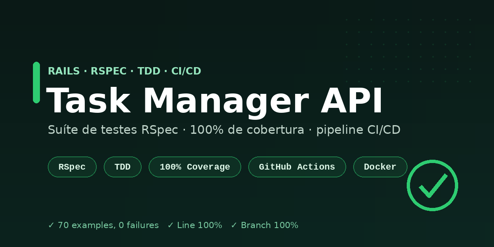

<p align="center">
  
</p>

<h1 align="center">Task Manager API · RSpec & CI/CD (TDD)</h1>

<p align="center">
  API REST em <strong>Ruby on Rails</strong> construída com <strong>TDD</strong>, suíte de testes
  <strong>RSpec</strong>, <strong>100% de cobertura</strong> (linha e branch) e pipeline de
  <strong>CI/CD no GitHub Actions</strong> que publica a imagem Docker no GHCR.
</p>

<p align="center">
  <a href="https://github.com/Dudainfinity/task-manager-api-rspec/actions/workflows/ci-cd.yml">
    
  </a>
  
  
  
  
  
</p>

---

## 🎯 Destaques

- 🧪 **70 exemplos de RSpec** cobrindo modelos, *service objects* e requests (testes de integração).
- 📊 **100% de cobertura** de linha **e** de branch, medida com **SimpleCov** e **exigida no CI** (mínimo 95% linha / 80% branch).
- 🧩 **TDD com service objects** — regra de negócio isolada e testada de forma unitária (`Projects::ProgressCalculator`, `Tasks::CompleteTask`).
- ✅ **shoulda-matchers** para specs de modelo expressivas (associações, validações, enums).
- 🏭 **FactoryBot + Faker** para dados de teste limpos, com *traits*.
- 🚀 **Pipeline CI/CD** (GitHub Actions): testes + cobertura, RuboCop, Brakeman e **build/publish da imagem Docker** no GitHub Container Registry.

## 🧱 Stack

| Camada | Tecnologia |
|---|---|
| Linguagem | Ruby 3.2 |
| Framework | Rails 8.1 (modo `--api`) |
| Banco | PostgreSQL 16 |
| IA | Anthropic SDK (Claude `claude-opus-4-8`) |
| Testes | RSpec, FactoryBot, Faker, shoulda-matchers |
| Cobertura | SimpleCov (linha + branch) |
| Qualidade | RuboCop (omakase), Brakeman |
| CI/CD | GitHub Actions, Docker, GHCR |

## 🧪 Estratégia de testes (TDD)

A lógica de negócio fica em **objetos pequenos e testáveis**, e cada um tem seu spec:

```
spec/
├─ models/                       # validações, enums, scopes, métodos de domínio (shoulda-matchers)
│  ├─ user_spec.rb
│  ├─ project_spec.rb
│  └─ task_spec.rb
├─ services/                     # regra de negócio isolada (unit tests)
│  ├─ projects/progress_calculator_spec.rb
│  └─ tasks/complete_task_spec.rb
├─ requests/api/v1/              # testes de integração ponta a ponta
│  ├─ projects_spec.rb
│  └─ tasks_spec.rb
└─ factories/                    # FactoryBot + traits (:done, :overdue, ...)
```

Rodando os testes:

```bash
bundle exec rspec
```

```
83 examples, 0 failures
Line Coverage:   100.0% (161 / 161)
Branch Coverage: 100.0% (30 / 30)
```

O relatório HTML é gerado em `coverage/index.html`. Para exigir os limites localmente:

```bash
COVERAGE=true bundle exec rspec   # falha se < 95% linha ou < 80% branch
```

## 🔄 Pipeline CI/CD

Definido em [`.github/workflows/ci-cd.yml`](.github/workflows/ci-cd.yml), dispara em push/PR para `main`:

| Estágio | Job | O que faz |
|---|---|---|
| **CI** | `test` | Sobe PostgreSQL 16, roda RSpec com cobertura (limites exigidos) e publica o relatório como artefato |
| **CI** | `lint` | RuboCop (estilo omakase) |
| **CI** | `security` | Brakeman (análise estática de segurança) |
| **CD** | `build-and-push` | Após o CI passar, no `main`: builda a imagem Docker e publica em `ghcr.io` |

A imagem publicada pode ser baixada com:

```bash
docker pull ghcr.io/dudainfinity/task-manager-api-rspec:latest
```

> O pacote no GHCR nasce **privado**. Para permitir `docker pull` anônimo, defina a
> visibilidade como *public* em **Packages → task-manager-api-rspec → Package settings**.

## 🗂️ Modelo de domínio

```
User
 └─ has_many Projects
Project ── belongs_to User, has_many Tasks
Task    ── belongs_to Project
          belongs_to Parent (Task, opcional) · has_many Subtasks (Task)
          status:   todo | in_progress | done
          priority: low | medium | high
```

Regras de negócio testadas: progresso do projeto (% de tarefas concluídas), conclusão de tarefa
(*idempotente*), reabertura, posição automática, detecção de atraso (`overdue?`) e *scopes*.

## 🚀 Começando

```bash
git clone https://github.com/Dudainfinity/task-manager-api-rspec.git
cd task-manager-api-rspec

bundle install
bin/rails db:setup       # cria, migra e popula com dados de exemplo
bin/rails server         # http://localhost:3000
```

## 📚 Endpoints

Base: `/api/v1`

| Método | Rota | Descrição |
|---|---|---|
| `GET` | `/projects` | Lista projetos (filtro `?user_id=`) |
| `POST` | `/projects` | Cria projeto |
| `GET` | `/projects/:id` | Detalha projeto (com `progress`) |
| `PATCH` | `/projects/:id` | Atualiza projeto |
| `DELETE` | `/projects/:id` | Remove projeto |
| `GET` | `/projects/:id/progress` | Estatísticas de progresso |
| `GET` | `/projects/:id/tasks` | Lista tarefas (filtros `?status=`, `?overdue=true`) |
| `POST` | `/projects/:id/tasks` | Cria tarefa |
| `GET` | `/projects/:id/tasks/:tid` | Detalha tarefa |
| `PATCH` | `/projects/:id/tasks/:tid` | Atualiza tarefa |
| `DELETE` | `/projects/:id/tasks/:tid` | Remove tarefa |
| `POST` | `/projects/:id/tasks/:tid/complete` | Conclui a tarefa (service object) |
| `POST` | `/projects/:id/tasks/:tid/suggest_subtasks` | 🤖 Gera subtarefas com a **Claude** e as cria como tasks filhas |

### Exemplo

```bash
# cria um projeto
curl -X POST http://localhost:3000/api/v1/projects \
  -d "name=Meu Projeto&user_id=1"

# adiciona e conclui uma tarefa
curl -X POST http://localhost:3000/api/v1/projects/1/tasks -d "title=Escrever testes&priority=high"
curl -X POST http://localhost:3000/api/v1/projects/1/tasks/1/complete

# gera subtarefas com a Claude e as persiste como tasks filhas (status: todo)
curl -X POST http://localhost:3000/api/v1/projects/1/tasks/1/suggest_subtasks
# => 201 Created — JSON:API com as tasks filhas criadas (parent_id = 1)
```

## 🤖 Integração com IA (Claude)

O endpoint `suggest_subtasks` usa o **SDK oficial da Anthropic** para pedir à Claude
(`claude-opus-4-8`) que quebre uma tarefa em subtarefas, e então **persiste** cada
sugestão como uma **task filha** (`parent_id`) no mesmo projeto — tudo em uma transação.
A lógica de IA fica isolada no service object
[`Tasks::SuggestSubtasks`](app/services/tasks/suggest_subtasks.rb), que força uma
**tool call** para garantir saída estruturada (sem parsing frágil de texto).

```bash
export ANTHROPIC_API_KEY=sk-ant-...   # necessário em runtime; nunca commitado
```

> **Testes não chamam a API real**: o cliente Anthropic é injetável e fica *stubado*
> nos specs, então a suíte (e o CI) roda sem chave e sem rede — mantendo 100% de cobertura.

## 📝 Licença

Distribuído sob a licença MIT. Veja [`LICENSE`](LICENSE).
